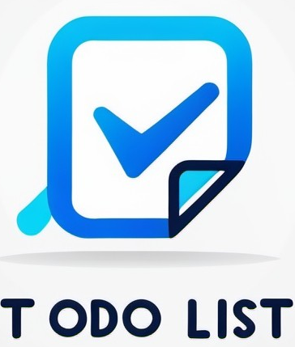

# To-Do List Application

<p align="center">
  
</p>


## Overview
The **To-Do List Application** is a Laravel-based project that allows users to manage their tasks efficiently with features such as CRUD operations, email reminders, Google Calendar integration, and public task sharing through access tokens.

---

## Features

### Core Features
1. **Task Management (CRUD):**
   - Add, edit, view, and delete tasks.
   - Fields include:
     - **Task Name** (max 255 characters, required)
     - **Description** (optional)
     - **Priority** (low/medium/high)
     - **Status** (to-do, in progress, done)
     - **Due Date** (date, required)

2. **Task Filtering:**
   - Filter tasks by priority, status, and due date.

3. **Email Reminders:**
   - Receive email notifications one day before a task's due date using Laravel Scheduler and Queues.

4. **User Authentication:**
   - Users can log in and manage their own tasks securely.

### Optional Features
1. **Task History:**
   - Track all changes made to tasks (name, description, priority, etc.).
   - View detailed history of edits.

2. **Public Task Sharing:**
   - Generate sharable links with an access token.
   - Tokens expire after a configurable duration.

3. **Google Calendar Integration:**
   - Add tasks to Google Calendar.
   - Automatically delete events from Google Calendar when a task is removed.

---

## Requirements

### Back-End
- PHP 8.2
- Laravel 11
- MySQL (or SQLite for local development)
- Composer

### Front-End
- Blade Templates
- Bootstrap (for UI styling)

### Optional Tools
- [spatie/laravel-google-calendar](https://github.com/spatie/laravel-google-calendar)

### Server Tools
- Mail server (e.g., SMTP for email reminders)
- Laravel Scheduler

---

## Installation and Setup

1. **Clone the Repository:**
   ```bash
   git clone https://github.com/Bartlomiejste/todo-list
   cd todo-list
   ```

2. **Install Dependencies:**
   ```bash
   composer install
   npm install && npm run dev
   ```

3. **Set Up Environment Variables:**
   Copy the `.env.example` file to `.env`:
   ```bash
   cp/copy .env.example .env
   ```
   Configure the following variables in `.env`:
   ```env
   APP_NAME=Todo-list
   APP_ENV=local
   APP_KEY=
   APP_DEBUG=true
   APP_TIMEZONE=Europe/Warsaw
   APP_URL=http://127.0.0.1:8000

   DB_CONNECTION=mysql
   DB_HOST=127.0.0.1
   DB_PORT=3306
   DB_DATABASE=todo-list
   DB_USERNAME=root
   DB_PASSWORD=

   MAIL_MAILER=smtp
   MAIL_HOST=your-smtp-host (in this project smtp.sendgrid.net)
   MAIL_PORT=587
   MAIL_USERNAME=your-email@example.com
   MAIL_PASSWORD=your-password
 

   GOOGLE_CALENDAR_CREDENTIALS_PATH=storage/app/google-calendar/service-account-credentials.json
   GOOGLE_CALENDAR_ID=your-calendar-id@group.calendar.google.com
   ```

4. **Generate Application Key:**
   ```bash
   php artisan key:generate
   ```

5. **Run Database Migrations:**
   ```bash
   php artisan migrate
   ```

6. **Set Up Scheduler:**
   Add the following cron job to automate task reminders:
   ```bash
   * * * * * php /path-to-your-project/artisan schedule:run >> /dev/null 2>&1
   ```

7. **Set Up Google Calendar Credentials:**
   - Obtain a service account credentials file from Google Cloud Console.
   - Save it as `storage/app/google-calendar/service-account-credentials.json`.
   - Update the `GOOGLE_CALENDAR_ID` in `.env` with the calendar ID.

8. **Start the Application:**
   ```bash
   php artisan serve
   ```

---

## Usage

1. **Access the Application:**
   Navigate to [http://127.0.0.1:8000](http://127.0.0.1:8000).

2. **User Actions:**
   - Create, edit, view, or delete tasks.
   - Filter tasks by priority, status, and due date.
   - Receive email reminders for tasks due the next day.

3. **Optional Features:**
   - Generate public links for tasks.
   - Sync tasks with Google Calendar.
   - View and manage task edit history.

---

## Testing

Run the following commands to test the application:
```bash
php artisan test
```

---

## Troubleshooting
- **Email Issues:** Ensure your SMTP server credentials in `.env` are correct.
- **Google Calendar Integration:** Double-check the service account credentials and calendar ID.
- **Scheduler Not Running:** Ensure the cron job is correctly configured.

For further assistance, please refer to the Laravel documentation or the package repositories used in this project.

